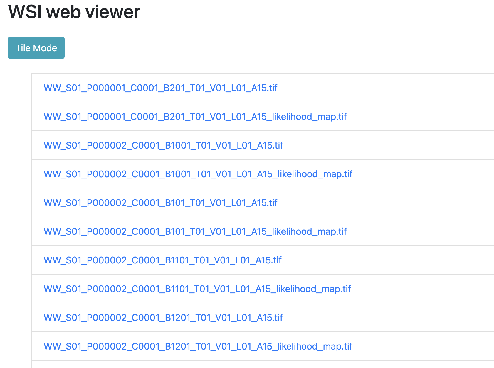
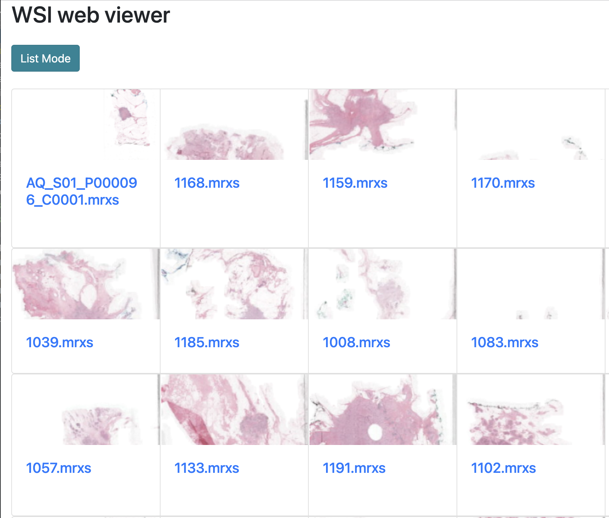

# Whole Slide Image Viewer for Pathology

This Django application provides a simple web interface for viewing pathology whole-slide-images . With the underlying `pyvips` library, it supports a wide range of file formats. The application converts these images to the Deep Zoom Image (DZI) format, which allows zooming and panning, by using OpenSeadragon. The application is built using Docker and Docker-compose, and can be easily deployed to any server.

## Prerequisites:

Before you begin, ensure you have met the following requirements:

- [Docker](https://www.docker.com/get-started)
- [Docker-compose](https://docs.docker.com/compose/install/)

## Running the Application:

To run the Whole Slide Image Viewer, follow these steps:

1. Clone the repository:
    ```bash
    git clone https://github.com/daangeijs/simple_wsi_viewer.git
    ```

2. Navigate to the project directory:
    ```bash
    cd simple_wsi_viewer
    ```

3. Use the provided Makefile to run the server:
    ```bash
     make runserver FOLDER=/path/to/your/imagefolder      
    ```

This will spin up the Django application. You can then navigate to the provided local URL in your web browser to access the image viewer interface.

## Screenshots
### List folder contents

### Catalog of folder contents

### Viewer with navigation


## Contributing:

If you'd like to contribute, please fork the repository and use a feature branch. Pull requests are warmly welcomed.
